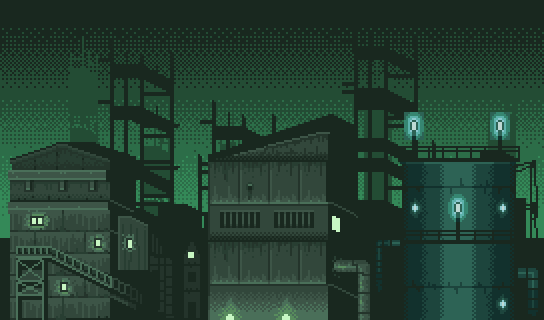

<h1 align="center">
  🌱<a href="https://vectorcmdr.github.io/senzai-startpage">SENZAI</a> StartPage
</h1>

<div align="center">
  
[![Stargazers][stars-shield]][stars-url] [![Issues][issues-shield]][issues-url] [![Contributors][contributors-shield]][contributors-url]
[![License][license-shield]][license-url] 

</div>

[issues-shield]: https://img.shields.io/github/issues/vectorcmdr/senzai-startpage?style=for-the-badge&logo=gitbook&color=fdac72&logoColor=f5f5ef&labelColor=2a262c
[issues-url]: https://github.com/vectorcmdr/senzai-startpage/graphs/issues

[contributors-shield]: https://img.shields.io/github/contributors/vectorcmdr/senzai-startpage?style=for-the-badge&logo=github&color=c5b4f8&logoColor=f5f5ef&labelColor=2a262c
[contributors-url]: https://github.com/vectorcmdr/senzai-startpage/graphs/contributors

[stars-shield]: https://img.shields.io/github/stars/vectorcmdr/senzai-startpage?style=for-the-badge&logo=starship&color=b9e48b&logoColor=f5f5ef&labelColor=2a262c
[stars-url]: https://github.com/vectorcmdr/senzai-startpage/stargazers

[license-shield]: https://img.shields.io/github/license/vectorcmdr/senzai-startpage?label=License&style=for-the-badge&logo=bookstack&color=49d1e9&logoColor=f5f5ef&labelColor=2a262c
[license-url]: https://github.com/vectorcmdr/senzai-startpage/blob/main/LICENSE.txt

<h3 align="center">
  <a href="https://vectorcmdr.github.io/senzai-startpage">Live Demo </a>
</h3>

<p align="center">
  
</p>

## 🔍 Overview

A simple, customizable startpage with todo list support. Featuring the [**senzai theme**](https://vectorcmdr.github.io/senzai-theme/).
Designed for functionality and aesthetics with seamless hosting on GitHub Pages, based on [`dawn`](https://github.com/b-coimbra/dawn).

### 💭 Goals

- Senzai theme & style
- Simplicity
- 1080x960 compatible
- Todo list
- Adjustable banner images
- Currency conversion rates
- Usage tips
- Dark & light mode

## 🚀 Usage

1. Fork and clone the repo
2. Update [`userconfig.js`](userconfig.js) to match your preferences, such as:
   - Disable components you don't want to use
   - Set the desired tab number font/language
   - Set your location for the weather widget
   - Change the clock format and icon color
   - Change the currency conversion display
   - Change the calendar link
   - Change the available search engines
   - Change keybindings
   - Enable last visited category tab on load
   - Update the number of category tabs and their names
   - Change category tab banners and their image position and scale
   - Update the bookmarks and links for the one you want to use
   - Change the icons, names and colors of those bookmarks

<i>Can also be run as a local file from your machine.</i>

> [!TIP]
> Clicking the blue information icon before the tab numbers provides a popup with usage tips.
>
> The bookmarks / links can be chosen from those available at [`tabler-icons`](https://tabler.io/icons).
>
> Supports a maximum of 6 category tabs.
>
> Additional banner images can be added by placing image files into [banners](src/img/banners) locally and adding them to `background_url` for that tab.
>
> Some software supports launching via URI and can be added as links (such as Discord and Steam via `discord://open/` and `steam://open/` respectively).
>
> The currency conversion API is rate limited to once a day (by the codebase, not the provider).
>
> The page can be toggled between dark and light via the toggle located at the top left of the page.
>
> Todo and preferences in page are stored locally, in browser. Using a different browser or device is an independant session.

### ⌨️ Keybinds
* <kbd>alt</kbd> + <kbd>Numbers row (1-6)</kbd> Switch tabs
* <kbd>t</kbd> Open the create task panel
* <kbd>Enter</kbd> Create a task
* <kbd>Tab</kbd> Go to next field
* <kbd>Esc</kbd> Close the edit/create task panel (when field is focused)
* <kbd>s</kbd> Open the search dialog
  - Type <kbd>!g</kbd> before your search query for Google
  - Type <kbd>!d</kbd> before your search query for DuckDuckGo
  - Type <kbd>!y</kbd> before your search query for YouTube
  - Type <kbd>!w</kbd> before your search query for Wikipedia

### 🏠 As Homepage

- Click your browsers menu button and select `Settings/Options/Preferences`
- Use the search, or navigate to homepage and new windows selection
- Click the menu next to the homepage and new windows selection and choose a custom URLs
- Enter your GitHub Pages link, or local file link

### ➕ As New Tab

Unfortunately, you will need to use add-ons/extensions for this for most browsers.

- For Gecko-based browsers (Firefox, Zen, etc.), use an addon such as [New Tab Override](https://addons.mozilla.org/en-US/firefox/addon/new-tab-override/) and point it to your page.
- For Chromium-based browsers (Chrome, Brave, Edge, etc.), use an addon such as [Custom New Tab](https://chromewebstore.google.com/detail/custom-new-tab/lfjnnkckddkopjfgmbcpdiolnmfobflj) and point it to your page.
<i>Alternatively, you can go to the extensions setting and turn on developer mode and load an unpacked extension. Select the root folder of your cloned repo.</i>


### 👨‍💻 Config Snippet Examples
<details>
<summary>Fold out for examples of how to change the config code.</summary>

#### 🚫 Component Disabling

To disable a component module, put their name into the list of `disabled` components like so:

```js
const CONFIG = new Config({
    // ...
    disabled: ['todo-list'] // currency-compare, current-time, weather-forecast, etc.
});
```

The names can be found listed in [`module.js`](src/common/module.js)

#### ➕ Tabs

Create new tabs and categories like so:

```js
const CONFIG = new Config({
    // ...
    tabs: [
        {
            name: 'chill',
            background_url: 'src/res/banners/cc0/space.gif',
            categories: [{
                name: 'video',
                links: [{
                    url: 'https://youtube.com',
                    name: 'youtube',
                    icon: 'brand-youtube',
                    icon_color: '#ff2d5e'
                }]
            }]
        }
    ]
)
```

#### 🕙 Clock

Change the clock format in the status bar using [strftime.org](https://strftime.org) format.

Config example (`userconfig.js`):

```js
const CONFIG = new Config({
  // ...
  clock: {
    format: 'h:i p',
  }
});
```

#### ⛅ Weather Info

Change your location and temperature scale (celius, fahrenheit) like so:

```js
const CONFIG = new Config({
  // ...
  temperature: {
    location: 'Canberra, ACT',
    scale: 'C'
  }
});
```
Alternatively, click on the weather widget on the page to swap between Celius and Fahrenheit.

#### 💱 Currency Exchange

Change your base currency and the two currencies to compare like so:

```js
const CONFIG = new Config({
  // ...
  currencyconv: {
      base: 'AUD',
      baseamount: '1',
      curone: 'USD',
      curoneglyph: '$',
      curtwo: 'JPY',
      curtwoglyph: '¥',
      url: 'https://www.google.com/finance/markets/currencies'
  },
});
```
</details>

### 🖼️ Tab Banners

The project ships with multiple banners for use.

There is a selection of CC0 images as well as some 'pop culture' gifs pulled from numerous gif sites (Giphy, Tenor, Imgur, etc.) that are obviously not owned by me and are used with the intent of fair and personal use only.

As mentioned in the usage tips, you can add your own custom images by adding them to the [banners](src/img/banners) directory and adding them to the [`userconfig.js`](userconfig.js), which allows you to change the relative positioning and absolute image scale.

The shipped CC0 images are:

| forest.gif                                           | industrial.gif                                           | mountains.gif                                           |
| ---------------------------------------------------- | -------------------------------------------------------- | ------------------------------------------------------- |
|  |  |  |

| outrun.gif                                           | park.gif                                                 | space.gif                                               |
| ---------------------------------------------------- | -------------------------------------------------------- | ------------------------------------------------------- |
|  |        |      |

| splash.gif                                           |
| ---------------------------------------------------- |
|  |


The shipped 'pop culture' images are:

| beebop_01.gif                                                   | beebop_02.gif                                                   | eva_01.gif                                                    |
| --------------------------------------------------------------- | --------------------------------------------------------------- | ------------------------------------------------------------- |
|  |  |   |

| eva_02.gif                                                      | eva_03.gif                                                      | eva_04.gif                                                    |
| --------------------------------------------------------------- | --------------------------------------------------------------- | ------------------------------------------------------------- |
|     |     |   |

| gits_01.gif                                                     | gits_02.gif                                                     | gits_03.gif                                                   |
| --------------------------------------------------------------- | --------------------------------------------------------------- | ------------------------------------------------------------- |
|    |    |  |
